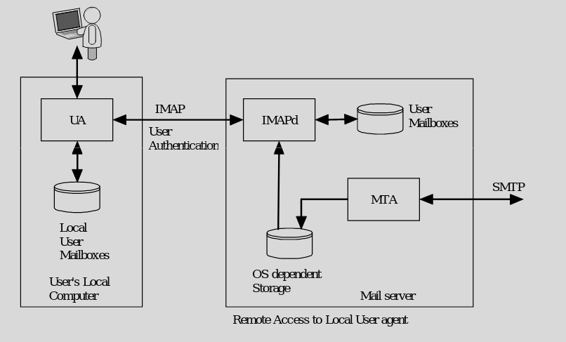
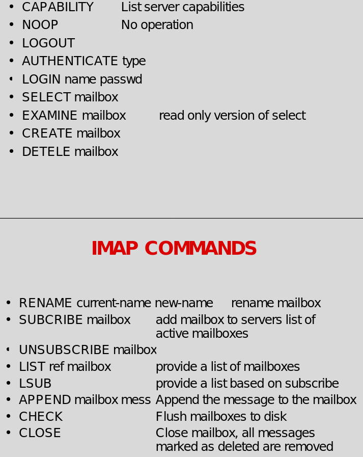

# IMAP

### Intro

- Supports message retrieval and filing
- POP, does not work with multiple client configs or UAs 
    - mail is deleted after it is read
- IMAP can keep messages on the server and an be used by multiple clients.
- Authentication still in plaintext

### Mailbox 

### Commands

# Attacks (Both POP3 and IMAP)

### Header
- Not really anything

### Authentication
- User authentication over the network
- Password guessing using POP or IMAP
    - Internal authentication to the software 
    - Instant connection on open telnet connection
- Every attempt can be logged
- Restrict POP and IMAP authentication to known IP addresses
- Use web client for remote access

### Traffic
- Flooding is not much of an issue
- Sniffing is an issue as not encrypted
    - There are encrypted versions of both IMAP and POP
    - Widely used
