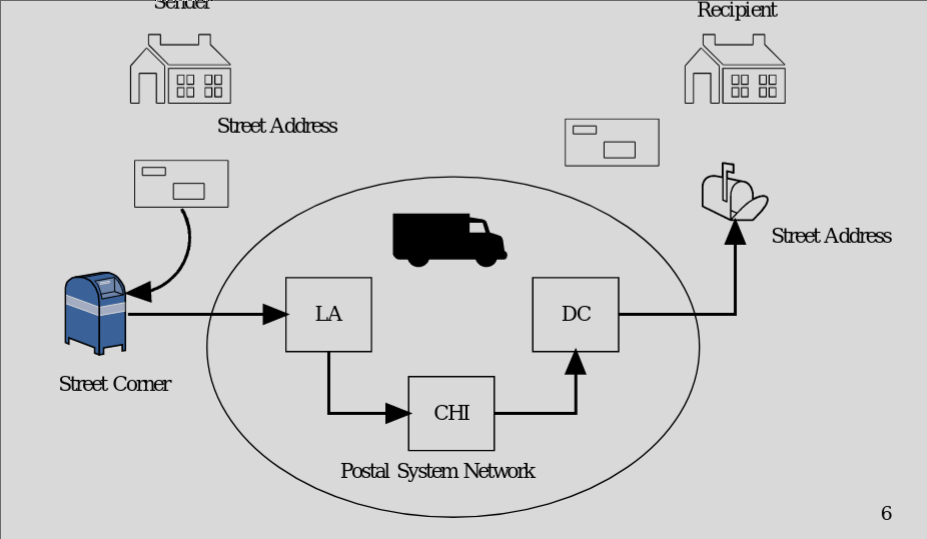

### Protocol Specifications
- Open vs Closed
- From the internet - 
    - Open use broad ideas to describe products/methods to use
        - Can have a wide list of solutions and providers 
    - Close lists specific providers of solutions 
        - More for an exact detailed description of how something would function
- From lecture - 
    - Same idea as open source and closed source 
    - Closed really only at application layer
    - Still can be reverse engineered and analyze the content of what they send
    - More of protection of Intellectual Property
    - Define the internet is open
    - Implementation is debate to have open or closed source code

- Specification methods / How does this effect security
    - English descriptions
        - Bunch of text and imprecise
        - Agree on meaning of words like agree, must, should
        - Open to interpretation
        - Edge conditions may not get handled/understood creating vulnerabilities
    - Flow & timing diagrams / State diagram
        - Open to interpretation
        - Assume talking to correct or same implementation
            - Don't catch edge cases
        - Adversaries can interject incorrect implementations
    - Packet Layout
        - Open to interpretation
    - Always can be coded incorrectly creating vulnerabilities

### Network Standards / Layout
- Overview
- Services provided / Function Calls
- Services expected / Function Calls
- Functions provided / Text
    - Simple or Complex
- Protocol and packet formats / Figs & Text
- Timing and sequence of the packets / Figs & Text

### Organizations - Who is in charge
- American National Standards Institute - ANSI
    - Not network focused
    - Standards to compete in global market
- International Organization for Standardization - ISO (since it is Swiss)
    - Made OSI model
    - ANSI is american representation to ISO
    - Not so much internet any more
- Institute Of Electrical and Electronics Engineers - IEEE
    - Creates large number of standards in every fields
    - 802 standards - local networking
    - Lengthy vetting of standards
    - Companies want to move standards to help their goals so need independent review
- Internet Engineering Task Force - IEFT 
    - Request for Comments - RFC
    - Here is idea and lets iterate to make a common idea

- Others from slides
    - International Telecommunications Union-Telecommunications Standards Sector - ITU-T

### Mailing Example of Addressing

- Ends are people sending mail to each other
- Share common address with other ends in a house
- Where to take it first
    - Blue bin
    - Mailbox
    - Sitting outside
- Post office takes it into the magical system 
    - Bring it to the other ends home
    - Multiple stops along way to get to that home
    - Only care about home
- Addressing becomes
    - Person it is going to
    - Home it is going to
    - Return address

- Digital 
    - Sending to which server and which application
    - Send to first router
    - Determine next best to send to, then these repeat, until reaching end/server
    - Server passes up to application 
    - Application needs source and creates new packet back to source

