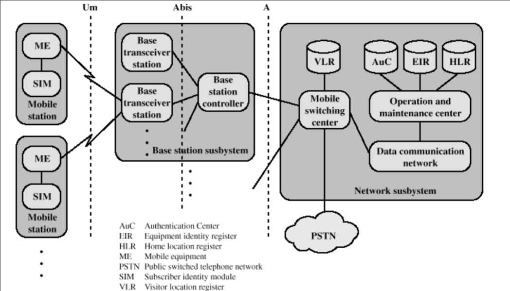
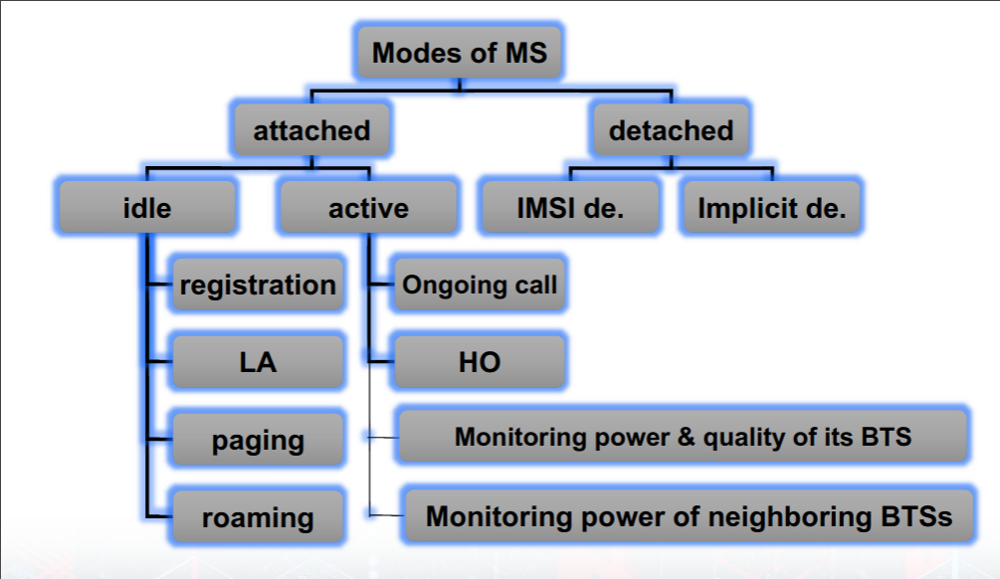

# GSM

### Architechure

- Network Subsystem == Core Network

### The Mobile station (MS)
- Mobile equipment (ME)
    - it is the terminal used by user
    - Can be purchased from any store
    - Without SIM no calls can be made
    - It has an International Mobile Equipment Identity (IMEI)

- Subscriber identity module (SIM)
    - An electronic microchip for storing information  
    - Subscriber info
    - Charging
    - **Security**

- Modes

### Base Station Subsystem
- Base Transceiver Station (BTS)
    - A cell is formed by the radio coverage of a BTS
    - Provide the radio channels and handle the radio‐link protocol
    - It contains the RF transmission equipment
    - Each BTS consists of one or more transceiver
    - It has an International cell global Identity (CGI)
    - It performs channel coding, encryption and modulation

- Base Station Controller (BSC)
    - Manage the radio resources for one or *more* BTS
    - Handle channel setup and handovers
    - Connect to the mobile service switching center
    - It carries out all control functions in the BSS as:
        - **Channel allocation**
        - Dynamic power control
        - **Handover**
        - Frequency hopping

- Dishes for connecting to other BTS

### Mobile service switching center (MSC)

