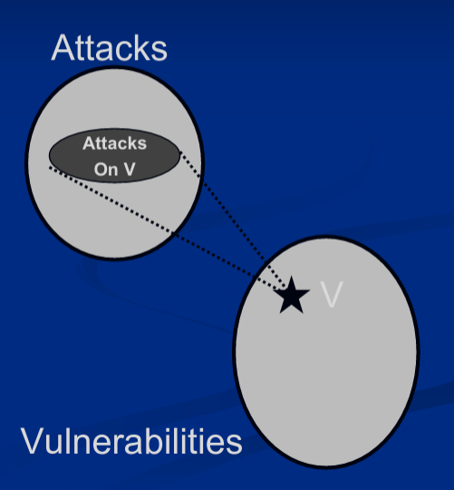

### Threats
- Basical the manifestation of "UH OH"
- Bad events that lead to losses 
- Not necessarily malicous 
    - Like earthquake or power failure
- Cyber attacks / viruses, take over of machine
- Theft or loss of info
- Idea - Powergrid is stressed with extreme wheather so prime time to attack 

### Risk Analysis
- Security Planning and Prioritization 
- Quanify likelihood of a thread 
    - difficult
    - Take estimates from industry
    - Past experience
    - Ask providers of these
- Either 
    - Low, medium, high categorization 
    - \# per year 

### Cost Benefit Analysis
- Evaluation of the cost to each risk 
    - \# per year times cost per each occurence
- Evaluation of the cost to countermeasures
    - Same idea
- Create a prioritization list 
    - Biggest savings are prioritized
- Sometimes creating a recovery system is cheaper than preventing risk
    - Maybe just deterrence - like security cameras

### Vulnerabilities
- Property or error of system allowing the violation of secrutiy policy
    - Property would mean intentional part of the system (malicous or not)
- Weakness that allows the loss of value
- Errors in:
    - Design - fundamental way the system is meant to act is weak - spoofing ips
    - Specification - written vaguely that allows for security issues
    - Implementation - certain way someone created a system is weak - buffer overflow or race conditions
    - Configuration - certain way a system is configured is weak - 0.0.0.0 in database settings 
- Occur when people make assumptions about the environment in which a system operates
    - Assuming input length -> buffer overflow
    - Objects don't change
    - Unlimited memory or bandwidth - what happens when they fail - unknown and vulnerable

### Attack 
- Low level - Action trying to break security policy using a vulnerability
- High level - many low level attacks towards a goal like exfiltration of data

### Exploit
- Procedure that carries out a low level attack
- IE a program that does an attack
- Exploiting a vuln == successfully attacked a system w/ such vuln
- Many attacks to vulns and few exploits know about

### Controls
- Countermeasures 
- Procedures or objects in place to prevent or mitigate successful exploitations of vulns
    - Training
    - Encryption
    - Firewalls
    - Backups

