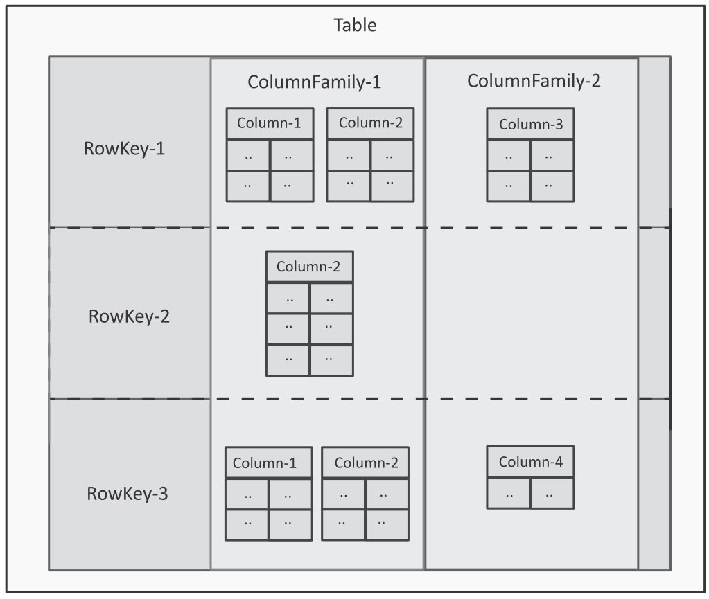
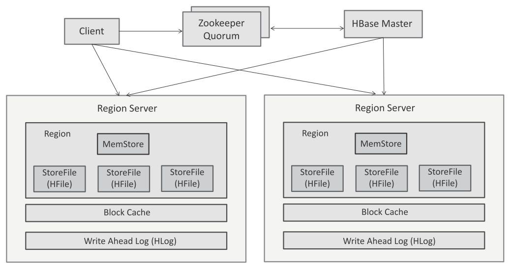
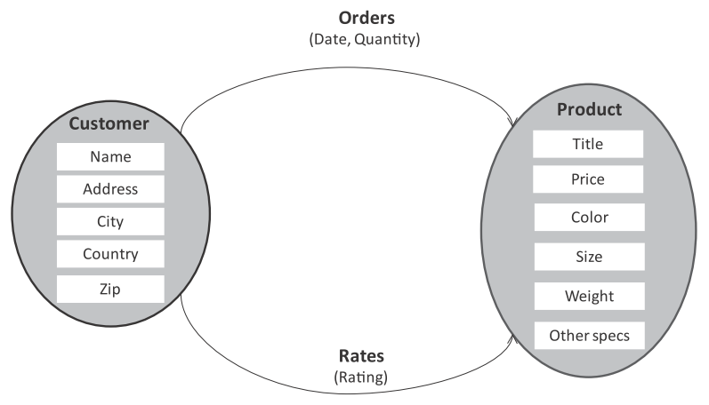

# NoSQL

### NoSQL db
- Non-relational db
- Better horizontal scaling and big data
    - less rigorous consistency models
- Optimized for fast retrieval and appending operations on records
- No strict schema
- Records in form like key-pair or documents
    - Classified by storage model or type of records
- BASE not ACID
    - Basicallly, Available, Soft-state, Eventually-Consistent

### Consistency, Availability & Partition Tolerance (CAP)
- Trade of betweem consistency and availability
    - under partitioning, can be one or the other at a time
- Consistent system
    - all reads guarenteed to incorporate previous writes
    - after update, seen by all readers
- Available system
    - Will always respond to query
    - Never unavailable
- Distributed data system is available when can preform even with node failure
- Partition tolerance, continue to preform with network partitions
    - Network Parition, when two or more nodes can't reach one another   

### Key-Value Databases
- Keys are unique ID for data (values)
- Generally distributed
- To determine parition, hash the key
- No tables like RDB
- Seems like giant hash map

### Amazon DynamoDB
- fully-managed
- high preformance
- Data models
    - Tables
        - collection of items
    - Items
        - collection of attributes
    - Attributes
- Assuming Key-value db

### Document Database
- Store encoded semi-structured data
    - like JSON, TAML, XML
    - semi-structured meaning are similar
- Stored using collections, buckets, or tags
- Each document has collection of named fields and values
    - Has unique key / ID
- More effiecient querying by attributes as compared to key-value
    - Better for type of data stored

### MongoDB
- document DB
- high scalability
- basic unit is document
- document is JSON set of key-value pairs

### Column Family Database
- Basic unit of data is column 
    - name and value
- Collection of columns is a row 
    - Identified by row key
- Columns grouped by column families
    - Number of columns in family varies across rows
    - Family can be thought of as a map having key-value pairs
        - Map varies across rows
    - Family stores data in denormalized form
        - All info that's relevant to an app can be read as single row 

### Hbase
- HBase table is consists of rows, which are indexed by the row key
- Each row includes multiple column families  
- Each column family includes multiple columns
    - Cells are timestamped
    - Delcared when creating table (can't be changed)
- No fixed schema

- Architecture
    - Run multiple region servers
    - Partition on the row key between regions
    - One master and region nodes (slaves)
        - Master stores meta data and region assignments
    - Zookeeper for distributed state coordination
        -  What is this?
    - ROOT and META tables identify which region server is responsible for serving a read/write request for a specific row key

### Graph Database
- Model data in nodes and relationships
- Nodes are data
    - Have attributes
- Relationship are represented by links in graph
    - bewteen nodes
    - Directed or undirected
- Amazon Neptune
    - Graph DB
    - low latency

### Neo4j
- Popular graph db
- Has Atomicity, Consistency, Isolation, Durability
- Nodes and relationships have properties which are attributes
- Nodes are labeled for different roles in domain
- Query language called cypher for CRUD operations

